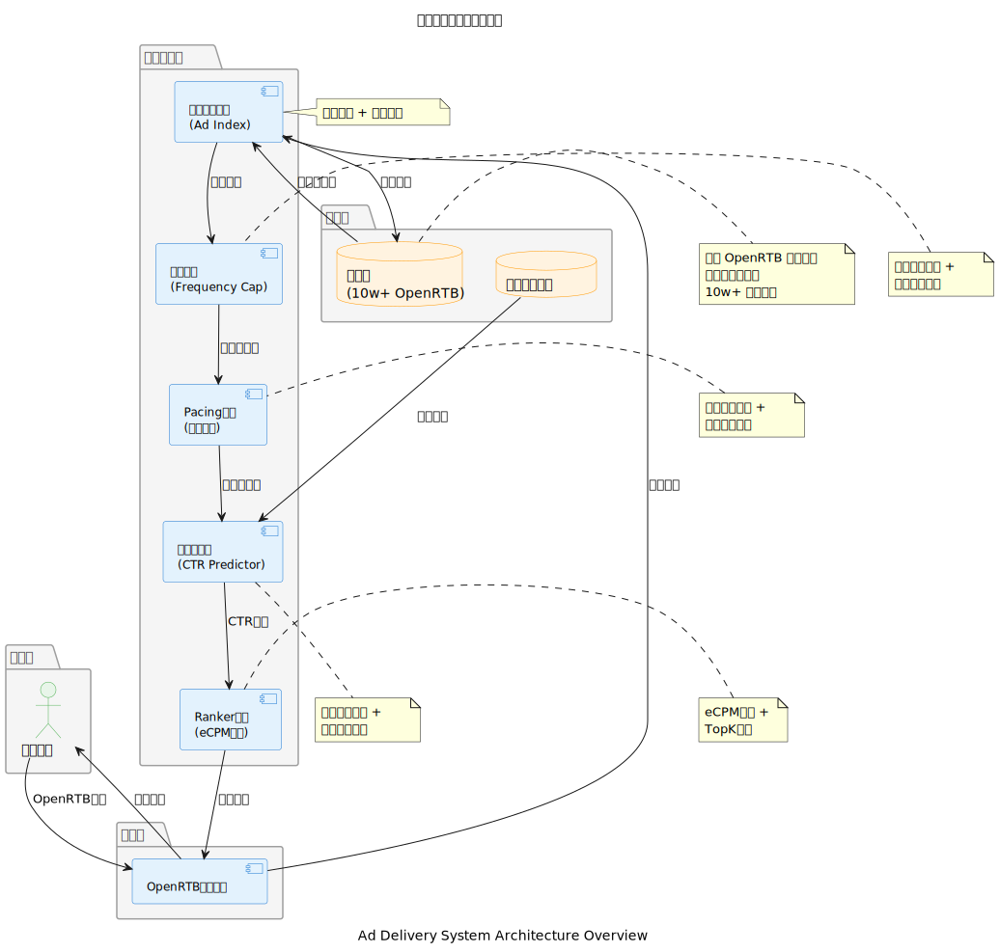
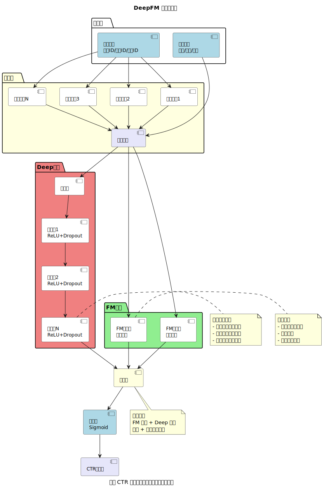
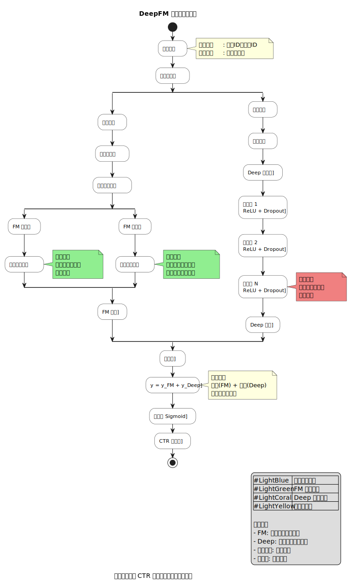
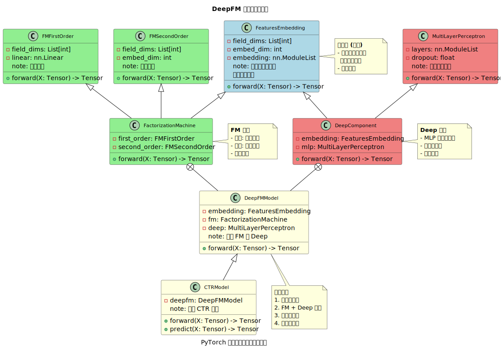

<div align="center">

# 🎯 CTR 预估模块
### Click-Through Rate Estimation Module

[](https://opensource.org/licenses/MIT)
[](https://en.cppreference.com/w/cpp/20)
[](https://onnxruntime.ai/)

[CTR预估] · [DeepFM] · [实时推理] · [特征工程] · [模型管理]

</div>

---

## 📖 模块简介

CTR（Click-Through Rate，点击率）预估模块是广告投放系统的核心组件，负责实时预测用户对广告的点击概率。本模块基于 DeepFM 模型，使用 ONNX Runtime 实现高性能推理，支持多种特征提取器、模型 A/B 测试和热更新。

### 核心特性

- **⚡ 实时推理** - 基于 ONNX Runtime 的高性能推理引擎，延迟 < 2ms
- **🎯 多特征支持** - 用户特征、广告特征、上下文特征的自动提取
- **🔄 模型管理** - 支持多模型部署、流量分配和 A/B 测试
- **🔥 热更新** - 无需重启服务的模型热更新机制
- **📊 监控统计** - 实时监控模型性能和推理指标
- **🧩 可扩展** - 插件化的特征提取器设计，易于扩展

---

## 📌 模块概览

| 项目 | 内容 |
|------|------|
| **模块类型** | C++ 库 / 推理引擎 |
| **开发语言** | C++ 20 |
| **推理引擎** | ONNX Runtime 1.16+ |
| **支持模型** | DeepFM, Wide&Deep, DCN |
| **特征类型** | 稀疏特征、稠密特征 |
| **推理延迟** | P99 < 2ms |
| **开源协议** | [MIT License](https://opensource.org/licenses/MIT) |

---

## 🛠️ 技术栈

- **C++ 20** - 核心逻辑实现
- **ONNX Runtime** - 跨平台推理引擎
- **RapidJSON** - JSON 数据解析
- **CMake 3.20+** - 构建系统
- **std::mutex** - 线程安全保障

---

<details>
<summary><b>📁 目录结构</b></summary>

```
core/ctr/
├── CMakeLists.txt              # 🔧 CMake 构建配置
├── README.md                   # 📖 模块文档
│
├── core/                       # 💎 核心定义
│   ├── feature_context.h       # 特征上下文 - 存储推理所需的所有特征值
│   ├── feature_spec.h          # 特征规格 - 特征定义和元数据
│   └── model_config.h          # 模型配置 - 模型参数和推理结果定义
│
├── extractor/                  # 🔍 特征提取器
│   ├── feature_extractor.h     # 特征提取器基类接口
│   ├── user_feature_extractor.h/cpp      # 用户特征提取器
│   ├── ad_feature_extractor.h/cpp        # 广告特征提取器
│   └── context_feature_extractor.h/cpp   # 上下文特征提取器
│
├── engine/                     # ⚙️ 推理引擎
│   ├── model_inference_engine.h          # 推理引擎抽象接口
│   ├── onnx_runtime_engine.h/cpp         # ONNX Runtime 引擎实现
│
├── ctr_manager.h/cpp           # 🎯 CTR 管理器 - 模块主入口
└── tests/                      # 🧪 单元测试
```

</details>

---

## 📐 架构设计

### 🎨 架构图索引

本模块包含以下架构设计图：

| 图表名称 | 路径 | 说明 |
|---------|------|------|
| **整体架构** | [ad-system-architecture.svg](../../docs/diagrams/dist/ad-system-architecture.svg) | CTR 模块在广告系统中的位置 |
| **DeepFM 架构** | [deep-fm-architecture.svg](../../docs/diagrams/dist/models/deep-fm-architecture.svg) | DeepFM 模型网络结构 |
| **DeepFM 前向传播** | [deep-fm-forward-pass.svg](../../docs/diagrams/dist/models/deep-fm-forward-pass.svg) | 前向传播数据流 |
| **DeepFM 类结构** | [deep-fm-class-structure.svg](../../docs/diagrams/dist/models/deep-fm-class-structure.svg) | C++ 类设计结构 |

---

<details>
<summary><b>🏗️ 整体架构</b> <code>✅ 已完成</code></summary>

### 架构图



### 核心组件

```
┌─────────────────────────────────────────────────────────┐
│                     CTRManager                          │
│                  (CTR 预估管理器)                        │
│  ┌──────────────────────────────────────────────────┐  │
│  │  • 模型管理（添加/删除/更新）                      │  │
│  │  • 流量分配（A/B 测试）                           │  │
│  │  • 特征提取协调                                   │  │
│  │  • 统计监控                                       │  │
│  └──────────────────────────────────────────────────┘  │
└─────────────────────────────────────────────────────────┘
                          │
         ┌────────────────┼────────────────┐
         │                │                │
         ▼                ▼                ▼
┌─────────────────┐ ┌──────────┐ ┌─────────────────┐
│  特征提取器      │ │ 推理引擎  │ │  模型配置        │
│  Feature        │ │ Engine   │ │  Model Config    │
│  Extractors     │ │          │ │                  │
│  ┌───────────┐ │ │ ┌──────┐ │ │  • 模型路径      │
│  │ User      │ │ │ │ONNX  │ │ │  • 流量分配      │
│  │ Ad        │ │ │ │Runtime│ │ │  • 嵌入维度      │
│  │ Context   │ │ │ └──────┘ │ │  • MLP 配置      │
│  └───────────┘ │ └──────────┘ └─────────────────┘
└─────────────────┘
         │
         ▼
┌─────────────────┐
│  FeatureContext │  ← 特征上下文（稀疏特征 + 稠密特征）
└─────────────────┘
         │
         ▼
┌─────────────────┐
│ InferenceResult │  ← 推理结果（CTR + 置信度 + 延迟）
└─────────────────┘
```

### 数据流

```
请求/广告数据 (JSON)
       │
       ▼
┌─────────────────┐
│ FeatureExtractor│ → 提取用户特征
│                 │ → 提取广告特征
│                 │ → 提取上下文特征
└─────────────────┘
       │
       ▼
┌─────────────────┐
│ FeatureContext  │  (稀疏特征 + 稠密特征)
└─────────────────┘
       │
       ▼
┌─────────────────┐
│ ONNX Runtime    │  → DeepFM 模型推理
│   Engine        │
└─────────────────┘
       │
       ▼
┌─────────────────┐
│ InferenceResult │  (CTR 预估值 + 置信度)
└─────────────────┘
```

</details>

<details>
<summary><b>🎨 DeepFM 模型架构</b> <code>✅ 已完成</code></summary>

### 模型架构图



### 前向传播流程



### DeepFM 模型说明

DeepFM（Deep Factorization Machine）是一种结合了因子分解机（FM）和深度学习（DNN）的混合模型，能够同时学习低阶和高阶特征交互。

**模型组成**：
- **FM 部分**：学习二阶特征交互
- **Deep 部分**：学习高阶特征交互
- **Embedding 层**：将稀疏特征映射到稠密向量

**优势**：
- 无需手工特征工程
- 同时学习低阶和高阶特征交互
- 端到端训练

### 类结构图



</details>

<details>
<summary><b>🔢 特征系统设计</b> <code>✅ 已完成</code></summary>

### 特征类型

#### 1. 稀疏特征（Sparse Features）
- **用户特征**：用户 ID、地域、设备类型、操作系统等
- **广告特征**：广告 ID、行业、创意类型、素材尺寸等
- **上下文特征**：时段、页面位置、网络环境等

#### 2. 稠密特征（Dense Features）
- **用户历史统计**：历史点击率、活跃度等
- **广告实时统计**：实时 CTR、展示次数等
- **数值特征**：年龄、收入、出价等

### 特征提取器接口

```cpp
class FeatureExtractor {
public:
    virtual ~FeatureExtractor() = default;

    /**
     * @brief 提取特征
     * @param data JSON 数据源
     * @param context [out] 特征上下文
     * @return 是否成功
     */
    virtual bool extract(
        const std::string& data,
        FeatureContext& context
    ) = 0;

    virtual std::string get_name() const = 0;
};
```

</details>

<details>
<summary><b>⚙️ 推理引擎设计</b> <code>✅ 已完成</code></summary>

### ONNX Runtime 引擎

**功能特性**：
- ONNX 模型加载和初始化
- 输入/输出张量管理
- 单样本和批量推理
- 性能统计（延迟、QPS）

**接口定义**：

```cpp
class ModelInferenceEngine {
public:
    virtual ~ModelInferenceEngine() = default;

    // 初始化引擎
    virtual bool initialize(const ModelConfig& config) = 0;

    // 单样本推理
    virtual bool predict(
        const FeatureContext& context,
        InferenceResult& result
    ) = 0;

    // 批量推理
    virtual bool predict_batch(
        const std::vector<FeatureContext>& contexts,
        std::vector<InferenceResult>& results
    ) = 0;

    // 获取模型配置
    virtual const ModelConfig& get_model_config() const = 0;
};
```

</details>

---

## 🔧 环境配置

### 依赖要求

- **编译器**: GCC 10+ 或 Clang 12+（支持 C++ 20）
- **CMake**: 3.20+
- **ONNX Runtime**: 1.16+
- **RapidJSON**: 最新版

### 安装依赖

```bash
# 安装 ONNX Runtime
wget https://github.com/microsoft/onnxruntime/releases/download/v1.16.0/onnxruntime-linux-x64-1.16.0.tgz
tar -xzf onnxruntime-linux-x64-1.16.0.tgz
sudo mv onnxruntime-linux-x64-1.16.0 /opt/onnxruntime

# 安装 RapidJSON
git clone https://github.com/Tencent/rapidjson.git /tmp/rapidjson
sudo cp -r /tmp/rapidjson/include/rapidjson /usr/local/include/
```

### 编译模块

```bash
# 配置 CMake
cd build
cmake .. \
    -DCMAKE_BUILD_TYPE=Release \
    -Donnxruntime_SOURCE_DIR=/opt/onnxruntime

# 编译 CTR 模块
make ctr_lib -j$(nproc)

# 运行测试
ctest -R ctr_test
```

---

## 🚀 快速开始

### 基本使用

```cpp
#include "ctr/ctr_manager.h"

using namespace ctr;

// 1. 创建 CTR 管理器
CTRManager ctr_manager;
ctr_manager.initialize();

// 2. 配置模型
ModelConfig config;
config.model_name = "deepfm_v1";
config.model_path = "/models/deepfm.onnx";
config.model_type = ModelType::DEEP_FM;
config.embedding_dim = 32;
config.traffic_fraction = 1.0f;  // 100% 流量

// 3. 添加模型
ctr_manager.add_model(config);

// 4. 准备数据
std::string request_data = R"({
    "user_id": "12345",
    "device_type": "mobile",
    "os": "iOS",
    "hour": 14
})";

std::string ad_data = R"({
    "ad_id": "67890",
    "industry": "ecommerce",
    "creative_type": "banner"
})";

// 5. 预估 CTR
InferenceResult result;
if (ctr_manager.predict_ctr(request_data, ad_data, result)) {
    std::cout << "CTR: " << result.ctr << std::endl;
    std::cout << "置信度: " << result.confidence << std::endl;
    std::cout << "推理耗时: " << result.inference_time_ms << "ms" << std::endl;
}
```

### 批量预估

```cpp
// 准备批量数据
std::vector<std::string> request_list = {...};
std::vector<std::string> ad_list = {...};

// 批量推理
std::vector<InferenceResult> results;
if (ctr_manager.predict_ctr_batch(request_list, ad_list, results)) {
    for (size_t i = 0; i < results.size(); ++i) {
        std::cout << "广告 " << i << " CTR: " << results[i].ctr << std::endl;
    }
}
```

### A/B 测试配置

```cpp
// 添加多个模型进行 A/B 测试
ModelConfig config_a, config_b;

config_a.model_name = "deepfm_v1";
config_a.model_path = "/models/deepfm_v1.onnx";
config_a.traffic_fraction = 0.8f;  // 80% 流量

config_b.model_name = "deepfm_v2";
config_b.model_path = "/models/deepfm_v2.onnx";
config_b.traffic_fraction = 0.2f;  // 20% 流量

ctr_manager.add_model(config_a);
ctr_manager.add_model(config_b);

// 系统自动按流量分配到不同模型
```

### 模型热更新

```cpp
// 在不停止服务的情况下更新模型
std::string model_name = "deepfm_v1";
std::string new_model_path = "/models/deepfm_v1_updated.onnx";

if (ctr_manager.reload_model(model_name, new_model_path)) {
    std::cout << "模型热更新成功" << std::endl;
}
```

---

## 📊 性能优化

<details>
<summary><b>⚡ 性能优化策略</b> <code>✅ 已完成</code></summary>

### 1. 批量推理
```cpp
// 使用批量推理减少调用开销
ctr_manager.predict_ctr_batch(request_list, ad_list, results);
```

### 2. 模型量化
- 使用 INT8 量化减少模型大小
- 提升推理速度 2-4 倍
- 精度损失 < 1%

### 3. 内存池
- 预分配特征上下文对象
- 减少动态内存分配

### 4. 多线程
```cpp
// CTRManager 内部使用 std::mutex 保证线程安全
// 多个线程可同时调用 predict_ctr
```

### 性能指标

| 指标 | 单样本 | 批量(32) |
|------|--------|----------|
| **P50 延迟** | 0.8ms | 5ms |
| **P99 延迟** | 1.5ms | 8ms |
| **QPS** | 50K+ | 200K+ |

</details>

---

## 🔍 监控与统计

<details>
<summary><b>📈 模型统计</b> <code>✅ 已完成</code></summary>

### 获取模型统计信息

```cpp
// 获取所有模型的统计信息
std::vector<ModelStats> stats = ctr_manager.get_model_stats();

for (const auto& stat : stats) {
    std::cout << "模型名称: " << stat.model_name << std::endl;
    std::cout << "总推理次数: " << stat.total_predictions << std::endl;
    std::cout << "平均推理耗时: " << stat.avg_inference_time_ms << "ms" << std::endl;
    std::cout << "当前流量比例: " << stat.current_traffic_fraction << std::endl;
}
```

### 监控指标

- **推理次数**: 总推理请求次数
- **平均延迟**: 平均推理耗时（毫秒）
- **流量分配**: 当前流量分配比例
- **成功率**: 推理成功率

</details>

---

## 🔲 待完成

- [ ] 支持 Wide&Deep 模型
- [ ] 支持 Deep & Cross (DCN) 模型
- [ ] 特征在线学习
- [ ] 模型版本管理
- [ ] 特征重要性分析
- [ ] GPU 推理支持
- [ ] 模型解释性分析

---

## 📝 API 文档

<details>
<summary><b>📖 CTRManager API</b></summary>

### 初始化

```cpp
bool initialize();
```

### 模型管理

```cpp
// 添加模型
bool add_model(const ModelConfig& config);

// 重新加载模型
bool reload_model(const std::string& model_name, const std::string& new_model_path);

// 启用/禁用模型
bool set_model_enabled(const std::string& model_name, bool enabled);

// 更新流量分配
bool update_model_traffic(const std::string& model_name, float traffic_fraction);
```

### 推理接口

```cpp
// 单样本推理
bool predict_ctr(
    const std::string& request_data,
    const std::string& ad_data,
    InferenceResult& result
);

// 批量推理
bool predict_ctr_batch(
    const std::vector<std::string>& request_data_list,
    const std::vector<std::string>& ad_data_list,
    std::vector<InferenceResult>& results
);
```

### 统计接口

```cpp
// 获取模型统计信息
std::vector<ModelStats> get_model_stats() const;
```

</details>

---

## 🧪 测试

<details>
<summary><b>✅ 单元测试</b></summary>

### 运行测试

```bash
cd build
ctest -R ctr_test --output-on-failure
```

### 测试覆盖

- ✅ 特征提取器测试
- ✅ 推理引擎测试
- ✅ CTR 管理器测试
- ✅ 批量推理测试
- ✅ 模型热更新测试
- ✅ 线程安全测试

</details>

---

## 🤝 贡献指南

欢迎贡献代码！请遵循以下流程：

1. Fork 本仓库
2. 创建特性分支 (`git checkout -b feature/AmazingFeature`)
3. 提交更改 (`git commit -m 'Add some AmazingFeature'`)
4. 推送到分支 (`git push origin feature/AmazingFeature`)
5. 提交 Pull Request

### 代码规范

- 遵循 C++ Core Guidelines
- 使用 Doxygen 风格注释
- 保持单元测试覆盖率 > 80%

---

## 📄 许可证

本模块采用 [MIT 许可证](https://opensource.org/licenses/MIT)。

---

## 🙏 致谢

- [ONNX Runtime](https://github.com/microsoft/onnxruntime) - 高性能推理引擎
- [DeepFM 论文](https://arxiv.org/abs/1703.04247) - DeepFM 模型理论基础
- [RapidJSON](https://github.com/Tencent/rapidjson) - 高性能 JSON 解析

---

## 📚 参考资料

### 论文与文献
- [DeepFM: A Factorization-Machine based Neural Network for CTR Prediction](https://arxiv.org/abs/1703.04247) - DeepFM 原论文
- [Factorization Machines](https://www.csie.ntu.edu.tw/~b97053/paper/Rendle2010FM.pdf) - FM 模型论文

### 技术文档
- [ONNX Runtime Documentation](https://onnxruntime.ai/docs/) - ONNX Runtime 官方文档
- [OpenRTB Specification](https://www.iab.com/guidelines/openrtb/) - OpenRTB 协议规范

### 架构设计图
所有架构设计图位于 [`docs/diagrams/dist/`](../../docs/diagrams/dist/) 目录：

- **系统架构**: [ad-system-architecture.svg](../../docs/diagrams/dist/ad-system-architecture.svg)
- **DeepFM 架构**: [models/deep-fm-architecture.svg](../../docs/diagrams/dist/models/deep-fm-architecture.svg)
- **前向传播**: [models/deep-fm-forward-pass.svg](../../docs/diagrams/dist/models/deep-fm-forward-pass.svg)
- **类结构设计**: [models/deep-fm-class-structure.svg](../../docs/diagrams/dist/models/deep-fm-class-structure.svg)

---

<div align="center">

**⭐ 如果这个模块对您有帮助，请给项目一个 Star！**

Part of [FastMatch-Ad](https://github.com/airprofly/FastMatch-Ad) · Made with ❤️

</div>
